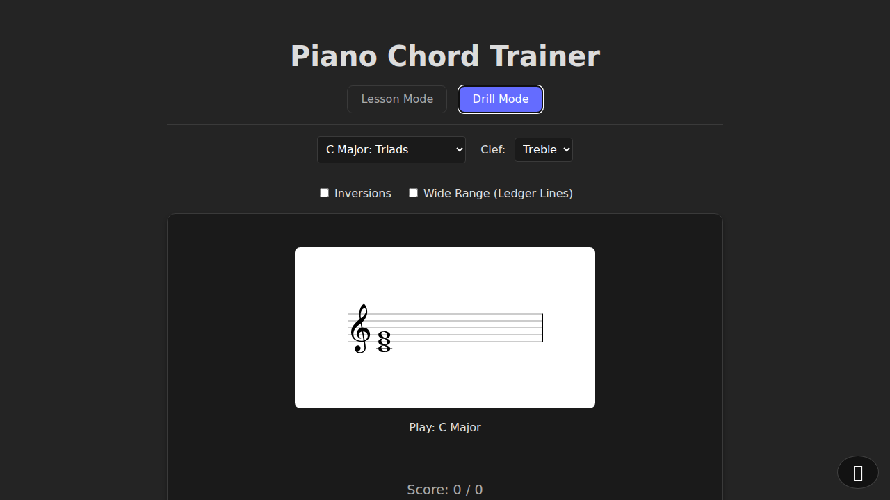

# Piano Chord Trainer (Alpha)

A comprehensive web-based tool for intermediate piano players to master chords, intervals, and sight-reading.



## Overview

Piano Chord Trainer is a progressive web application (PWA) designed to help musicians build fluency in identifying and playing chords, voicings, and inversions. Unlike basic flashcard apps, it emphasizes musical context by rendering notation on a staff and supporting real-time MIDI input.

## Features

### 🎹 Core Capabilities
*   **Multiple Key Signatures:** Practice in Major, Minor, Harmonic Minor, Melodic Minor, and other modes (Dorian, Mixolydian, etc.). Supports keys up to 6 sharps/flats.
*   **Interactive Drills:**
    *   **Chord Identification:** Identify chords displayed on the staff.
    *   **Sight-Reading:** Play the notes of a chord on your MIDI keyboard.
    *   **Melody & Intervals:** Train your ear and reading skills with melodic patterns and interval recognition.
    *   **Speed Drills:** Challenge your reaction time.
*   **Flexible Input Methods:**
    *   **MIDI Keyboard:** Connect any MIDI-compatible device for the best experience.
    *   **Microphone:** Use your acoustic piano (monophonic pitch detection supported).
    *   **Text/UI:** Fallback options for use without an instrument.
*   **Smart Voicings:** The drill engine ensures chords are generated with musically practical voicings and inversions.

### 🚀 Technical Highlights
*   **Progressive Web App (PWA):** Installable on desktop and mobile, with offline support.
*   **Audio Engine:** High-quality piano samples powered by Tone.js.
*   **Notation:** Dynamic music notation rendering using VexFlow.

## Installation & Usage

### Prerequisites
*   Node.js (v20 or higher recommended)
*   npm

### Local Development

1.  **Clone the repository:**
    ```bash
    git clone https://github.com/yourusername/piano-chord-trainer.git
    cd piano-chord-trainer
    ```

2.  **Install dependencies:**
    ```bash
    npm install
    ```

3.  **Start the development server:**
    ```bash
    npm run dev
    ```
    Open your browser to the URL shown (usually `http://localhost:5173`).

## Deployment

This project is configured for automatic deployment to **GitHub Pages**.

### Setting up GitHub Pages
1.  Go to your repository **Settings** on GitHub.
2.  Navigate to **Pages** (in the sidebar).
3.  Under **Build and deployment** > **Source**, select **GitHub Actions**.
4.  The pre-configured workflow (`.github/workflows/deploy.yml`) will automatically build and deploy the application whenever you push to the `main` branch.

## Technology Stack

*   **Framework:** Vanilla TypeScript with Vite
*   **Audio:** Tone.js, Pitchy (Microphone Input)
*   **Notation:** VexFlow
*   **Input:** WebMIDI API
*   **Testing:** Vitest, Playwright

## Status

**Alpha:** The application is functional but actively being improved. Some features (like polyphonic microphone input) may have limitations.
